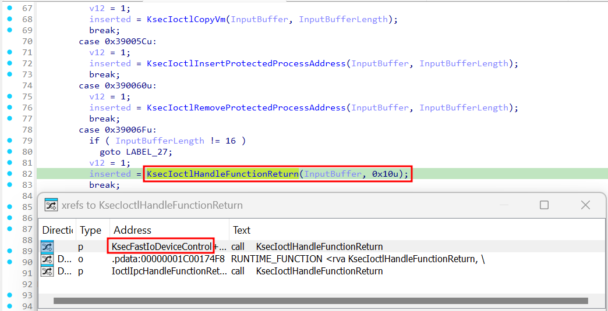
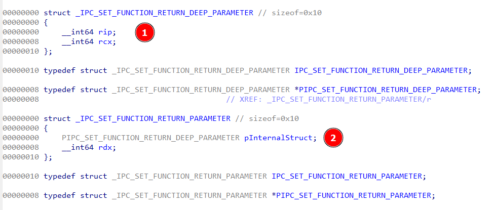
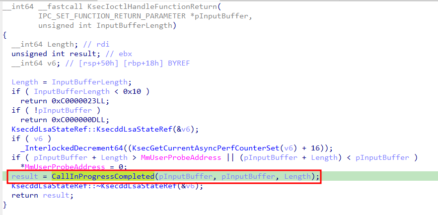
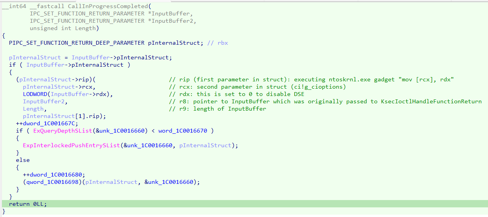
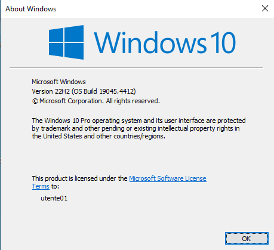
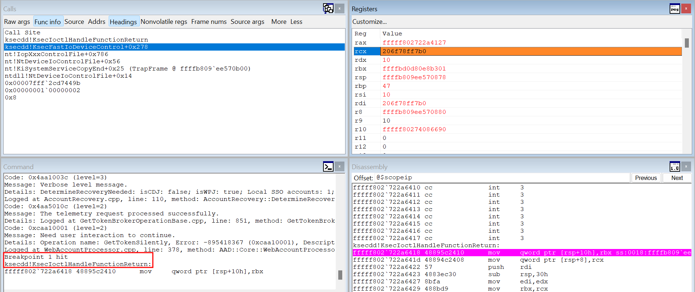
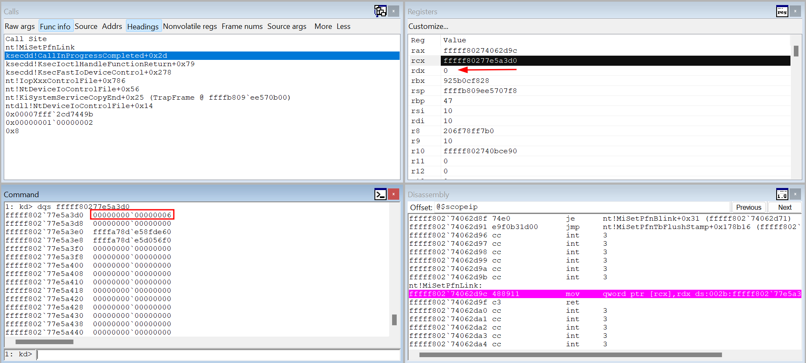
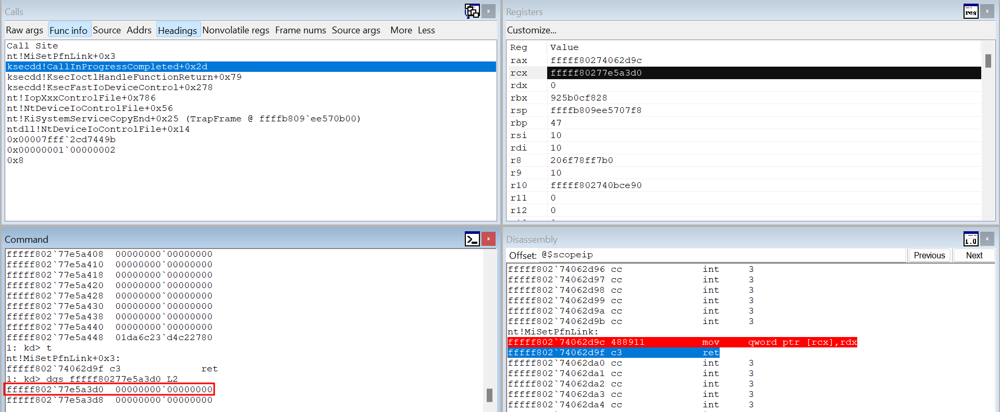
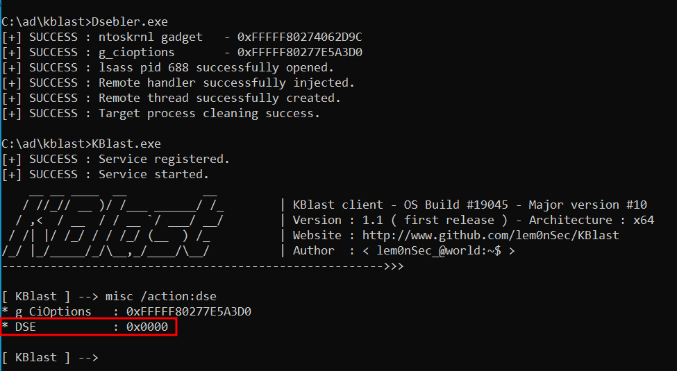

# Dsebler
Dsebler is a reimplementation of the __Driver Signature Enforcement (DSE) bypass technique__ showed by [floesen](https://github.com/floesen/KExecDD). The code was restructured and reorganized with the possibility of easily adding ntoskrnl gadget and g_cioptions offsets. I also preferred the injection of a code block with replaceable function pointers over dll injection. That said, this repo is a technical analysis of the technique. The code here is temporary, and the repo will be archived as soon as the technique will be added to [KBlast](https://github.com/lem0nSec/KBlast).

## DSE?
Driver Signature Enforcement is a Microsoft security feature which ensures that only trusted and verified drivers can be loaded onto the Windows operating system. This is among other things to prevent untrusted and potentially malicious software to cause harm to the OS. Since the value which regulates the behaviour of DSE is inside the Windows kernel itself, it cannot be technically disabled from userland unless a vulnerability is found on a trusted driver which allows for arbitrary writing on the Windows kernel.

## Static Analysis on IDA
The Microsoft Kernel Mode Security Support Provider Interface (KsecDD) is a system driver which provides cryptographic services since Windows Vista. Even dpapi.dll relies on KsecDD.sys to conduct its main tasks. Interestinly, [floesen](https://github.com/floesen) found out that KsecDD allows lsass.exe to run custom kernel addresses with the possibility to also set parameters through the IOCTL 0x39006f. When this control code is issued, the KsecFastIoDeviceControl dispatchar calls the function KsecIoctlHandleFunctionReturn as shown below.

The case statement first checks whether the buffer length which was sent from userland is 16. If so it passes execution to KsecIoctlHandleFunctionReturn.
The parameter that is passed to KsecIoctlHandleFunctionReturn is a 16-byte-large data structure which I named IPC_SET_FUNCTION_RETURN_PARAMETER. The struct holds two 8-byte values. The first is a pointer to a second 16-byte data structure which in turn holds a pointer which will be the custom address to be executed (rip), whereas the second value is a pointer to the first parameter that is passed at execution time (rcx). Going back to the main struct, the second 8-byte value is the value that will go into rdx at execution time.

 KsecIoctlHandleFunctionReturn performs some checks on whether the passed struct is large 16 bytes and whether the address is a userland address. The most important part is the call to the function CallInProgressCompleted, which is where the actual execution logic resides.

 

 As shown below, the decompiled version of the CallInProgressCompleted executes the first value of pInternalStruct (IPC_SET_FUNCTION_RETURN_DEEP_PARAMETER struct), whose pointer is in turn the first value of the IPC_SET_FUNCTION_RETURN_PARAMETER struct which is passed to KsecIoctlHandleFunctionReturn from userland by lsass.exe. The second value of pInternalStruct is passed as first parameter in rcx, and the second value of the original IPC_SET_FUNCTION_RETURN_PARAMETER struct is passed as second parameter (rdx).

## Brief POC on Windbg
The Windows OS used to run this code is a Windows 10 build 19045.

After attacching Windbg to the kernel of the virtual machine, a breakpoint is placed on KsecIoctlHandleFunctionReturn. After running Dsebler.exe the breakpoint is hit, and the call stack also shows that the function is called from KsecFastIoDeviceControl.

Moving on it can be seen that the CallInProgressCompleted function finally calls the ntoskrnl.exe gadget "mov \[rcx\], rdx" which is the first value of pInternalStruct (IPC_SET_FUNCTION_RETURN_DEEP_PARAMETER). By the same token rcx is a pointer to g_cioptions, which is the second value of pInternalStruct and rdx is the second value of pParameterStruct (IPC_SET_FUNCTION_RETURN_PARAMETER). Rdx is 0 in order to write 0 to g_cioptions.

By stepping into the next instruction g_cioptions gets successfully overwritten with 0 and DSE disabled.

Attempting to load the unsigned driver of [KBlast](https://github.com/lem0nSec/KBlast) now works. Shout out to [floesen](https://github.com/floesen) for the amazing finding!!

## Reference
https://github.com/floesen/KExecDD
